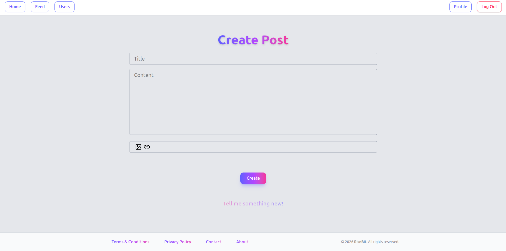

# RiseBit - Social Media Platform

## About

RiseBit is a modern social media platform that transforms how people share, interact, and build communities online.

Built with cutting-edge web technologies, RiseBit combines sleek design with powerful features to create a social experience that's both intuitive and engaging. Share your moments, discover new content, and connect with others—all in one seamless platform.

### Feed

## Why RiseBit?

- **Beautiful Design** - A clean, modern interface that feels natural
- **Lightning Fast** - Built for performance and reliability
- **Engaging Interactions** - Real-time updates and seamless social features
- **Responsive** - Perfect experience on any device

*Developed for Hack Club's Moonshot Program*

## Features

- User Authentication (Sign Up, Log In, Log Out)
- Create posts
- Follow and Unfollow Users
- User Profiles
- Real-time Updates
- And more

## Tech Stack

- Next.js
- Tailwind CSS
- Supabase
- TypeScript
- Prisma
- Cludinary
- Vercel
- VS Code
- PostgreSQL
- etc.

### Create Post

### Profile Page

## Contributing

Contributions are always welcome! Please feel free to submit a Pull Request.

### Made for Moonshot event, hosted by HackClub

